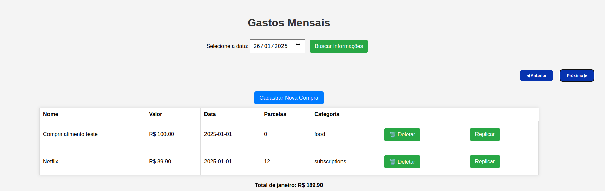

# 💸 Gastos Mensais

Um projeto web simples para visualização e gerenciamento de **despesas mensais**. Esta aplicação permite buscar, visualizar, deletar e replicar registros de compras, além de navegar por diferentes meses para consultar os gastos correspondentes.

## 🔍 Visão Geral

A aplicação fornece:

- Busca de compras por data.
- Exibição em tabela com informações como nome, valor, data, parcelas e categoria.
- Ações de deletar e replicar compras.
- Navegação entre meses para facilitar o acompanhamento mensal.
- Cálculo e exibição do total de gastos do mês selecionado.
- Botão para cadastro de novas compras.

## 📸 Demonstração

  

## 🛠 Tecnologias Utilizadas

- **HTML5**
- **CSS3**
- **JavaScript (vanilla)**
- API REST (esteja rodando em `http://localhost:8080`)

## 🚀 Como Rodar

1. Clone o repositório:
   ```bash
   git clone https://github.com/seu-usuario/nome-do-repo.git
   cd nome-do-repo